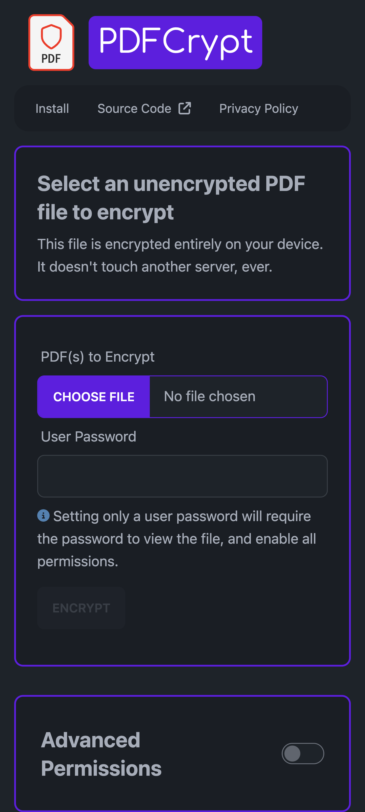
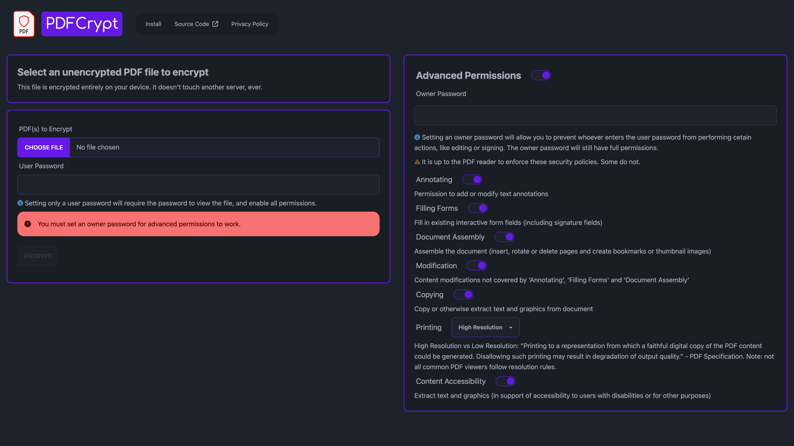

# pdfcrypt

## Secure, simple and fast PDF encryption PWA.

For some reason, most PDF software requires payment to perform encryption, and most websites require an account or uploading to the server. Turns out you can just do it all client-side in JavaScript, so I made a PWA that works offline. It even has advanced security permissions support!

## Install

You can visit https://pdfcrypt.randomblock1.com to check it out. Once you want to install, you can install it from your web browser, or if you're on Windows, you can install it from the Microsoft Store.

## Screenshots

